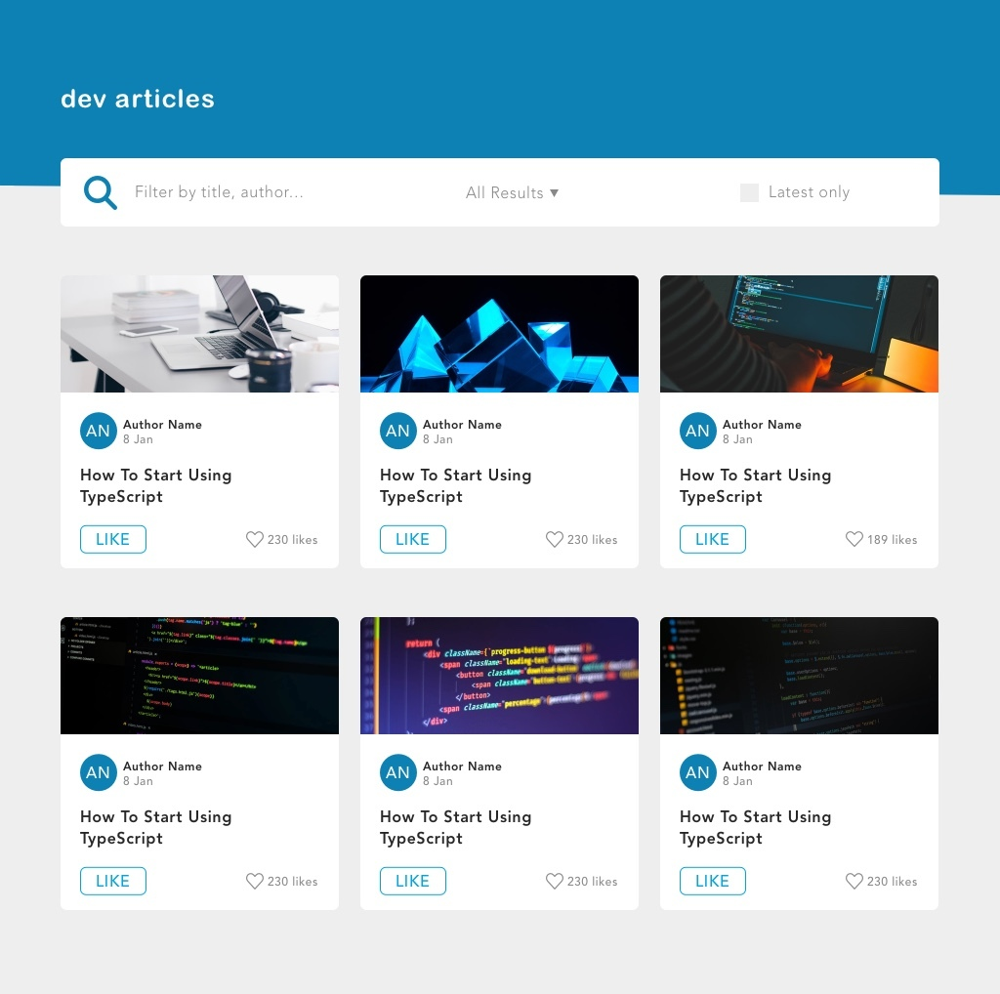
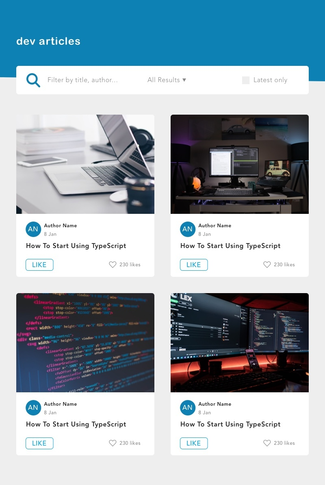
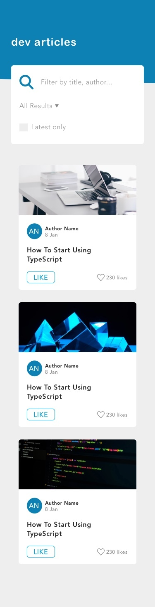
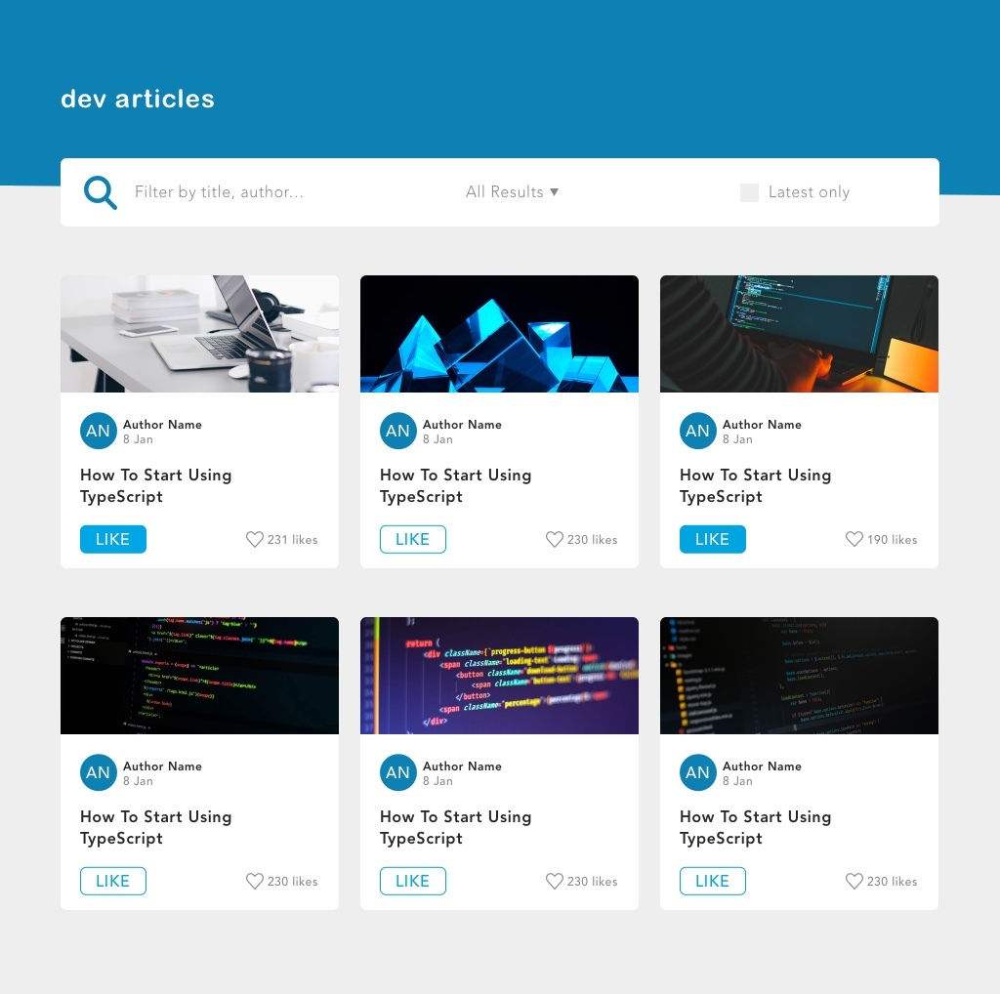

# ALL IN Frontend Bewerbung

## Willkommen

Vielen Dank für Deine Bewerbung! Um die praktischen Fähigkeiten unserer Bewerber zu prüfen, bitten wir jeden Bewerber die anschließende Aufgabe zu bearbeiten.

### KI-Nutzung ausdrücklich erwünscht

In der ALL IN Gruppe setzen wir stark auf den Einsatz von KI-Tools in der Entwicklung. Wir glauben, dass die Fähigkeit, effektiv mit KI-Assistenten zu arbeiten, eine der wichtigsten Kompetenzen moderner Entwickler ist.

**Du bist ausdrücklich dazu eingeladen, KI-Tools (z.B. GitHub Copilot, ChatGPT, Claude, Cursor, etc.) für die Bearbeitung dieser Aufgabe zu nutzen.**

Bitte reiche zusammen mit Deiner Lösung auch den **Chatverlauf oder zumindest Deinen initialen Prompt** ein, mit dem Du die KI angeleitet hast (z.B. als `PROMPT.md` im Repository). Dies hilft uns, Deine Herangehensweise und Dein Verständnis für effektives Prompt Engineering zu beurteilen.

### Technische Anforderungen

Die Aufgabe soll mit einem JavaScript Framework, sowie TypeScript umgesetzt werden. Da wir selbst Vue.js einsetzen, würden wir dieses bevorzugen, jedes andere moderne JavaScript Framework ist aber auch in Ordnung. Weiterhin würden wir Dich bitten kein CSS Framework (wie z.B. Bootstrap oder TailwindCSS) einzusetzen und darauf zu achten, dass semantisches HTML verwendet wird.

Wir erwarten keine perfekte Lösung in Rekordzeit – nimm Dir die Zeit, die Du brauchst, um ein Ergebnis zu liefern, das Deine Arbeitsweise widerspiegelt.

### Was wir bewerten

Wir bewerten nicht, ob Du alles selbst getippt hast, sondern: **Code-Qualität**, **Architektur-Entscheidungen**, **Test-Abdeckung** und Dein **Verständnis für das, was die KI produziert hat**.

### Abgabe

Um Deine Aufgabe einzureichen, erstelle bitte ein privates GitHub-Repository und lade [JennyZeiser](https://github.com/JennyZeiser), [hoersamu](https://github.com/hoersamu) und [Botz](https://github.com/Botz) dazu ein.

Sollte dies nicht möglich sein, kannst Du den Quellcode auch über eine `.zip` Datei mit uns teilen.

## Aufgabenstellung

Bei dieser Aufgabe geht es um die Umsetzung eines responsiven Karten-Layouts, wobei die Karten gefiltert und sortiert werden können.

Die Daten für die Karten können über eine von uns bereitgestellte API abgefragt werden.

Setze bitte das mitgelieferte Design, sowie die beschriebenen Funktionalitäten um. Achte dabei bitte auch darauf die Applikation ausreichend zu testen.

### Teil 1 - Design umsetzen

Im Verzeichnis `mockups` findest Du die umzusetzenden Layouts:

Die Liste von Karten soll responsiv umgesetzt werden, wobei die maximale Breite des Content-Bereichs 920px und die minimale 320px betragen soll.

Bei jedem Breakpoint soll der zur Verfügung stehenden Platz optimal ausgenutzt werden. Das heißt auch, dass die Karten innerhalb eines Breakpoints die Größe verändern können.

Das Gesamtlayout besteht aus einem Header mit Überschrift, einer Funktionsleiste und einer Liste mit Karten.

Die Funktionsleiste beinhaltet ein Suchfeld, ein Filter-Dropdown, sowie eine Checkbox.

Die einzelnen Karten sind folgendermaßen aufgebaut:

- Titelbild
- Autoren-Avatar (blauer Kreis mit Initialen des Autors)
- Name des Autors
- Erstellungsdatum des Artikels
- Titel des Beitrags
- Like-Button, welcher in Abhängigkeit des Zustands das Styling ändert (siehe `active-states.jpg`)
- Anzahl der Likes

Bitte verwende für die Umsetzung das folgende Color Scheme, dieses ist auch nochmal in der Datei `color-scheme.jpg` enthalten.

Die Daten für die Karten können über den Endpunkt `https://www.myposter.de/web-api/job-interview` abgefragt werden. Eine OpenAPI v3.0 Spezifikation der API Schnittstelle befindet sich in der Datei `api.json`.

**Hinweise:**

- Die zu verwendenden Icons findest Du im Verzeichnis `assets`
- In den Designs wird unsere Brand Font (`AvenirNext`) verwendet, da diese proprietär ist, bitte eine andere verwenden

### Teil 2 - Funktionalität umsetzen

Bitte setze die nachfolgend beschriebenen Funktionen um.

**App Funktionen**

Über die Suchfunktion soll man nach Autoren und Titeln suchen können. Dabei sollen nur die gefilterten Karten angezeigt werden.

Die Beiträge sollen weiterhin über ein Dropdown nach Name des Autors (alphabetisch) oder Datum (auf- und absteigend) sortiert werden können.

Wenn die Checkbox aktiviert wird, sollen nur Beiträge aus dem aktuellen Jahr angezeigt werden.

**Card Funktionen**

Der User kann über einen Button den Beitrag liken/unliken. In Abhängigkeit davon ändert sich auch das Styling des Buttons (siehe `active-states.jpg`), sowie die Anzahl der Likes.

### Teil 3 - Tests schreiben
Bitte schreibe sinnvolle Tests für Deine Applikation.
